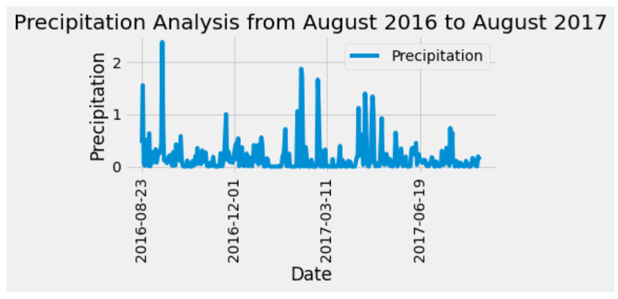

# SQLAlchemy-Challenge - Surfs Up

Congratulations! You've decided to treat yourself to a long holiday vacation in Honolulu, Hawaii! 

According to GoVisitHawaii.com Hawaii’s weather is warm all year round with daytime high temperatures ranging from 78F in the “colder” months to 88F in the hotter months. Hawaii’s proximity to the equator means that its weather is tropically warm and consistent throughout the year. Flowers are always in bloom in Hawaii. Typically December, January, and February are the coolest months, while July, August and September are the warmest months. 

Further according to GoVisitHawaii.com, the months of April – October tend to have less rain than the months of November – March. The following chart shows how the average rainfall varies by month and by Hawaiian Island.

This research project involved the hawaii.sqlite databse and the two tables - Measurement and Stations. 

### Objectives

Using SQLAlchemy ORM queries, Pandas and Matplotlib, we were challenged to complete the following:

## Step One - Precipitation and Station Analysis

### Precipitation Analysis

   1. Start by finding the most recent date in the data set.

   2. Using this date, retrieve the average precipitation per day for the previous 12 months. The query should be sorted by date ascending. 
   
   3. Load the query results into a Pandas DataFrame and set the index to the date column.
   
   4. Plot the results using the DataFrame `plot` method. 

   5. Use Pandas to print the summary statistics for the precipitation data. 

### Station Analysis

   1. Design a query to calculate the total number of stations in the dataset.

   2. Design a query that lists all stations with their corresponding observation count in descending order (observation count corresponds to the number of rows per station).

   3. Which station id is the most active (i.e., has the greatest number of observations)?

   4. Calculate the lowest, highest, and average temperature for that station id (i.e., the one with the greatest number of observations).

   5. Design a query to retrieve the last 12 months of temperature observation data (TOBS) for the most active station.

   6. Plot the results as a histogram with `bins=12`.

## Step 2 - Climate App

   1. Use Flask to create the following routes.

### Routes

* `/`

  * Home page.

  * List all routes that are available.

* `/api/v1.0/precipitation`

  * Using the query from part 1 (most recent 12 months of precipitation data), convert the query results to a dictionary using `date` as the key and `prcp` as the value.
  * Return the JSON representation of your dictionary (note the specific format of your dictionary as required from above).

* `/api/v1.0/stations`

  * Return a JSON list of stations from the dataset.

* `/api/v1.0/tobs`

  * Query the dates and temperature observations of the **most active station** for the most recent 12 months of data.
  * Return a JSON list of temperature observations (TOBS) for that year.

* `/api/v1.0/<start>` and `/api/v1.0/<start>/<end>`

  * Create a query that returns the minimum temperature, the average temperature, and the max temperature for a given start or start-end range.
  * When given the start date only, calculate min, max, and avg for all dates greater than and equal to the start date.
  * When given the start and the end date, calculate the minimum, average, and maximum obvserved temperature for dates between the start and end date inclusive.
  * Return a JSONified dictionary of these minimum, maximum, and average temperatures.

### Analysis
Dataset contains 9 stations and daily temperature readings from 1/1/2010 to 8/23/2017. We analyzed precipitation for the year 8/23/16 to 8/23/17. 

While GoVisitHawaii.com indicates that the months of April – October tend to have less rain than the months of November – March, we found spikes in or about February-March; April-May; September; and November.

### Technologies Used
SQLAlchemy
Pandas 
Matplotlib
Datetime

### Project Status
Base project completed.

### Suggestions to Improve Analysis
1. Compare precipitation from other years.
2. Identify the location of the weather stations.
3. Where are the "less active" stations located?

### Issues
1. Issues with Visual Studio Code finding Python debugger and Flask. 

## References

Menne, M.J., I. Durre, R.S. Vose, B.E. Gleason, and T.G. Houston, 2012: An overview of the Global Historical Climatology Network-Daily Database. Journal of Atmospheric and Oceanic Technology, 29, 897-910, [https://doi.org/10.1175/JTECH-D-11-00103.1](https://doi.org/10.1175/JTECH-D-11-00103.1)

- - -

© 2021 Trilogy Education Services, LLC, a 2U, Inc. brand. Confidential and Proprietary. All Rights Reserved.

